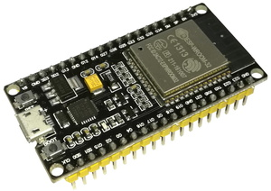
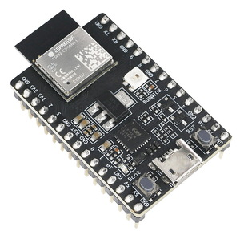
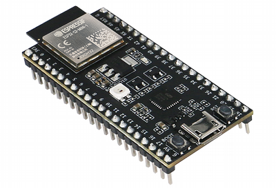
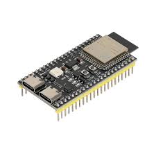

## Introducción
Thonny es una herramienta para programación en Python (IDE), principalmente se utiliza para conectar y programar dispositivos con Micropython.

## Instalación
1. Acceder a <https://thonny.org>

2. En la sección *Download* (descargas), hacer click en la versión correspondiente a su sistema operativo.

3. Ejecutar el archivo descargado, se iniciará un asistente de instalación que le guiará paso a paso. 

## Descarga de driver para Windows 
Algunas versiones de dispositivos, requieren la instalación de drivers para lograr la comuinicación. A continuación se ecplica el proceso correspondiente a la ESP32-WROOM-32 (38 pines).

1. Acceder a <https://www.silabs.com/developers/usb-to-uart-bridge-vcp-drivers?tab=downloads>

2. Descargar el driver *CP210x Universal Windows Driver*

3. Guardarlo y descomprimirlo en una ubicación conocida y de fácil acceso.

4. Conectar la ESP32.

5. Abrir el *Administrador de dispositivos* y buscar el dispositivo que aparezca como desconocido o en la sección *otros*.

6. Dar doble click en este

7. Dar click en la opción *Actualizar controlador*

8. Dentro de la opción de controladores, seleccionar la opción de *Buscar controladores en mi equipo*

9. Dar click en *examinar*

10. Seleccionar la carpeta donde previamente se descomprimió el *CP210x Universal Windows Driver*

11. Una vez que termine el proceso de instalación, el controlador ya está instalado y el dispositivo listo para usarse.

## Instalar o Actualizar el firmware de Micropython

1. En el menú “Run”, seleccionar “Configure Interpreter...”

2. En la pestaña “Interpreter”, seleccionar "Install or update MicroPython (espool)"
3. Elegir el puerto correspondiente
4. Elegir el firmware que corresponda a la tarjeta de la familia MicroPython (normalmente trabajaremos con los modelos ESP32, ESP32-S2, ESP32-S3 o ESP32-C3, pero puede ser otro):

**ESP32** https://micropython.org/download/ESP32_GENERIC/

**ESP32 C3** https://micropython.org/download/ESP32_GENERIC_C3/

**ESP32-S2** https://micropython.org/download/ESP32_GENERIC_S2/

**ESP32-S3** https://micropython.org/download/ESP32_GENERIC_S3/

6. Click en "Instalar"
   

7. Si no es posible hacer la carga automática (hay algún error), manten presionado el botón de *boot* en la tarjeta mientras presionas una vez el botón de reinicio en la ESP y a continuación click en *Instalar*. Una vez que comience la carga del firmware puedes soltar el botón *boot*.

Nota: Todas las ESP32 cuentan con 2 botones, uno es el *reset* (para reiniciar) y el otro es el *boot* para entrar a la rutina de carga de firmware. Normalmente vienen etiquetados en la PCB, pero si te es complicado encontrar la etiqueta, puedes presionarlos y probar cuál hace el reinicio y el otro será el *boot*. 

## Configuración para conectar a la ESP32
1. Abrir Thonny

2. En el menú *Run*, seleccionar *Configure Interpreter...*

3. En la pestaña *Interpreter*, seleccionar *Micropython (ESP32)* y el puerto correspondiente (en Windows aparece como *Silicon Labs CP210x USB to UART Bridge* o *Dispositivo serie USB (COM##)*.

4. Desactivar todas las opciones de la última sección, excepto *restart interpreter before running a script* (como se muestra en la siguiente imagen)

5. Click en OK para aplicar la configuración y regresar a la ventana principal. En la zona inferior se muestra la ventana de Shell con un mensaje similar a "Micropython v.1.22.22 ...". Este mensaje nos indica la versión de Micropython instalada en la ESP32, así como la versión de la placa que estamos usando. Finalmente veremos el prompt del intérprete ( >>> ) indicando que la ESP32 se encuentra lista para recibir instrucciones. 

Si no se muestra el mensaje indicado, probablemente ha ocurrido algún error, comunmente es suficiente presionar el botón STOP (en la barra de botones) o reiniciar la ESP32.
Esto último lo podemos hacer presionando CTRL+D o con el botón de reset en la placa (típicamente indicado con RST).

6. Finalmente, para facilitar el manejo de los programas, es conveniente activar la pestaña "files". 
Para esto, vamos al menú "view" y activamos la opción "files" en la lista que se nos mostrará.
Esto nos desplegará un panel del lado izquierdo con la lista de los archivos que se encuentran tanto en nuestra computadora como en la ESP32 (llamado Micropython device). 
Esto se ilustra en la siguiente imagen.

Esta pestaña es bastante útil para cargar archivos a la ESP32, bastará seleccionar el o los archivos que se quieran copiar, dar click derecho y seleccionar la opción "Upload to \".
De manera similar podemos respaldar archivos que se encuentran en la ESP32 a nuestra computadora, dando click derecho y seleccionando la opción "Download to ...".

