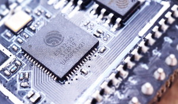

## Introducción
Thonny es un software de programación principalmente utilizado para conectar dispositivos con micropython.

## Instalación
1. Acceder a <https://thonny.org>
2. En la sección Download (descargas), hacer click en la versión correspondiente a su sistema operativo.

3. Ejecutar el archivo descargado, se iniciará un asistente de instalación que le guiará paso a paso. 

## Configuración para conectar a la ESP32

1. Abrir Thonny,
2. En el menú “Run”, seleccionar “Configure Interpreter...”

3. En la pestaña “Interpreter”, seleccionar “Micropython (ESP32)” y el puerto correspondiente (en Windows aparece como “Silicon Labs CP210x USB to UART Bridge”).
4. Desactivar todas las opciones de la última sección, excepto "restart interpreter before running a script"
5. Click en OK

## Instalar o Actualizar el firmware de Micropython

1. En el menú “Run”, seleccionar “Configure Interpreter...”

2. En la pestaña “Interpreter”, seleccionar "Install or update MicroPython (espool)"
3. Elegir el puerto correspondiente, familia MicroPython (ESP32, ESP32-S2, ESP32-S3 o ESP32-C3) y variante "Espressif"
   
ESP32  

ESP32-S2  

ESP32-C3 

5. Click en "Instalar"
   

6. Por ultimo presionar el botón reset de la tarjeta y el botón reset en thonny. 

